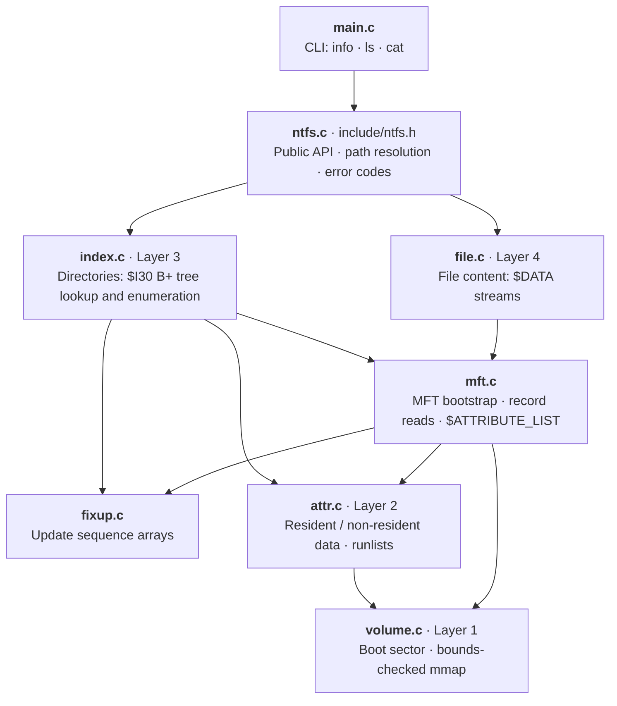
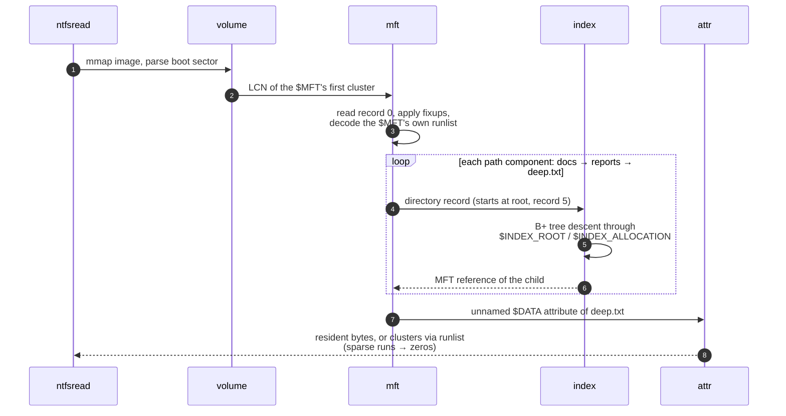

<div align="center">

# 🗂️ NTFS_Reader

**A read-only NTFS explorer written in C, built from the on-disk format up.**

Point it at a raw NTFS image and it lists directories, reads files and alternate data streams,
and reports volume geometry. It uses no libraries beyond libc, no kernel driver and no `ntfs-3g`.
Every byte is decoded by hand.


[Features](#-features) ·
[Quick start](#-quick-start) ·
[Library API](#-library-api) ·
[Architecture](#-architecture) ·
[How it works](#-how-it-works) ·
[Testing](#-testing) ·
[Limitations](#-limitations)

</div>

---

> [!NOTE]
> **Academic origin.** This repository is a professional restructuring of a project first written for the
> **Computer Architecture and Operating Systems** course at **Universidad de San Andrés** (UdeSA), Argentina.
> The coursework was turned into a standalone project with a layered parser, a public library API, a small CLI,
> defensive handling of untrusted input, an automated test harness and full documentation.

---

## ✨ Features

| | |
|---|---|
| 🧱 **From scratch** | Boot sector, MFT, attributes, data runs and B+ tree indexes are all parsed directly from the spec. The only dependency is libc. |
| 📂 **Directory listing** | Walks the `$I30` B+ tree in order, so entries come out already sorted. Works for small directories (`$INDEX_ROOT` only) and large ones (`$INDEX_ALLOCATION` blocks). |
| 📄 **File reading** | Reads both resident data (stored inside the MFT record) and non-resident data (mapped through runlists). |
| 🕳️ **Sparse files** | Sparse runs and bytes past `initialized_size` read back as zeros, the same as the Windows driver returns. |
| 🔀 **Alternate data streams** | `file.txt:stream` reads a named `$DATA` stream, including streams attached to directories. |
| 🧩 **Attribute lists** | Follows `$ATTRIBUTE_LIST` into extension records when a file's attributes don't fit in one MFT record. |
| 🛡️ **Untrusted-input hardening** | Every pointer into the image goes through one bounds check. Fixups catch torn writes, tree depth is capped, and size fields are sanity-checked. |
| 🌐 **Unicode names** | Converts between UTF-16LE and UTF-8 in both directions, including surrogate pairs; invalid sequences become U+FFFD. |
| 📚 **Reusable library** | A small public API (`include/ntfs.h`) with explicit error codes. The CLI is a thin wrapper around it. |

---

## 🚀 Quick start

### Build

```bash
git clone https://github.com/BarralMaximo/NTFS_Reader.git
cd NTFS_Reader
make            # → build/ntfsread
```

Any C11 compiler with GNU attributes works (GCC or Clang). The build treats warnings as errors.

### Usage

```text
usage: ntfsread <image> <command> [args]

commands:
  info         print volume geometry
  ls [PATH]    list a directory (default: /)
  cat PATH     write a file's content to stdout;
               PATH may be file:stream for alternate streams
```

### Example session

The output below was not captured from a real run. It follows the CLI's exact output format, with the values `mkfs.ntfs` uses by default for a 16 MiB image. The volume serial is random on a real image.

```console
$ ntfsread disk.img info
bytes per sector    512
sectors per cluster 8
cluster size        4096
MFT record size     1024
index block size    4096
total sectors       32767
$MFT first LCN      4
volume serial       3f1c9a7e52d08b46

$ ntfsread disk.img ls /docs
-        300      69  readme.txt
d          0      67  reports

$ ntfsread disk.img cat /docs/reports/deep.txt > deep.txt

$ ntfsread disk.img cat /ads.txt:extra
hidden stream
```

Any NTFS image works: a `dd` dump of a partition, a forensic image, or one you create yourself:

```bash
truncate -s 16M disk.img && mkfs.ntfs -F -q disk.img
```

`ls` prints four columns: type (`d` or `-`), size in bytes, MFT record number, and name.
Exit codes are `0` on success, `1` on error (with a message on stderr) and `2` on bad usage.

---

## 📚 Library API

The CLI is about 100 lines on top of a small API declared in [`include/ntfs.h`](include/ntfs.h):

```c
int  ntfs_open(const char *image_path, ntfs_volume **out);
void ntfs_close(ntfs_volume *vol);
void ntfs_get_info(const ntfs_volume *vol, ntfs_volume_info *out);
int  ntfs_list(ntfs_volume *vol, const char *path, ntfs_dirent **entries, size_t *count);
int  ntfs_read_file(ntfs_volume *vol, const char *path, uint8_t **data, uint64_t *size);
```

```c
#include <stdio.h>
#include <stdlib.h>
#include "ntfs.h"

int main(void)
{
    ntfs_volume *vol;
    int err = ntfs_open("disk.img", &vol);
    if (err) {
        fprintf(stderr, "open: %s\n", ntfs_strerror(err));
        return 1;
    }

    ntfs_dirent *ents;
    size_t n;
    if (ntfs_list(vol, "/", &ents, &n) == NTFS_OK) {
        for (size_t i = 0; i < n; i++)
            printf("%s%s\n", ents[i].name, ents[i].is_directory ? "/" : "");
        free(ents);
    }

    ntfs_close(vol);
    return 0;
}
```

Every function returns `NTFS_OK` (0) or a negative error code, and `ntfs_strerror()` turns a code into a message:

| Code | Meaning |
|---|---|
| `NTFS_ERR_IO` | Cannot open or read the image file |
| `NTFS_ERR_FORMAT` | Not NTFS, or an on-disk structure is corrupt |
| `NTFS_ERR_NOENT` | No such file or directory |
| `NTFS_ERR_NOTDIR` | A path component is not a directory |
| `NTFS_ERR_ISDIR` | Tried to read a directory as a file |
| `NTFS_ERR_NOMEM` | Allocation failure |
| `NTFS_ERR_UNSUP` | Valid NTFS, but uses a feature this reader does not implement |

---

## 🧱 Architecture

The parser is split into layers. Each layer knows one thing about the format and relies on the one below it.



| Module | Responsibility |
|---|---|
| [`volume.c`](src/volume.c) | Memory-maps the image read-only, checks the `NTFS    ` OEM ID and decodes the BPB, including the format's odd encodings (negative `clusters_per_mft_record`, `sectors_per_cluster` > 0x80). Provides `volume_at()`, the single bounds check every other layer depends on. |
| [`attr.c`](src/attr.c) | Decodes runlists (VCN→LCN mappings), reads through them with sparse support, and materializes any attribute whether resident or not. It doesn't care about attribute *types*: it returns bytes and leaves the meaning to the layers above. |
| [`fixup.c`](src/fixup.c) | Checks and undoes the multi-sector transfer protection on MFT records and index blocks. |
| [`mft.c`](src/mft.c) | Bootstraps the MFT from itself, reads and validates records, iterates attributes, and follows `$ATTRIBUTE_LIST` indirection. |
| [`index.c`](src/index.c) | Walks the B+ tree for lookup (one root-to-leaf descent) or enumeration (in-order traversal), and converts names between UTF-16 and UTF-8. |
| [`file.c`](src/file.c) | Finds the requested `$DATA` stream (unnamed or named) and reads it into memory. |
| [`ntfs.c`](src/ntfs.c) | Resolves paths component by component, handles `:stream` suffixes, hides DOS 8.3 aliases, and maps everything to the public API. |

---

## 🔬 How it works

Here is what happens when you run `ntfsread disk.img cat /docs/reports/deep.txt`:



### 1. Reading the MFT requires the MFT

The Master File Table describes every file on the volume, including itself (record 0). That creates a loop: to read any record you need the `$MFT`'s data runs, and those are stored inside record 0. The boot sector breaks the loop by storing the LCN of the MFT's **first** extent. Record 0 sits there, and once its `$DATA` runlist is decoded it maps every other record, even if the MFT is fragmented.

### 2. Fixups (update sequence arrays)

Structures written across several sectors, such as MFT records and `INDX` blocks, protect against torn writes. The last two bytes of every 512-byte stride are replaced on disk by a sequence number, and the original bytes are saved in an array in the header:

```text
             stride 0 (512 B)                          stride 1 (512 B)
 ┌───────────────────────────────────────┬─────┐ ┌──────────────────────────────┬─────┐
 │ FILE │ … │ USA: [seq][orig₀][orig₁] … │ seq │ │ …                            │ seq │   ← on disk
 └───────────────────────────────────────┴─────┘ └──────────────────────────────┴─────┘
                                           ▼                                       ▼
                                         orig₀                                   orig₁     ← after fixup
```

`fixup_apply()` checks that every stride ends with the sequence number (a mismatch means the write never finished, so the structure is rejected) and then puts the original bytes back. A parser that skips this step reads two garbage bytes at every 512-byte boundary.

### 3. Runlists: a compact, relative encoding

A non-resident attribute stores *where* its clusters live as a variable-length list of runs. Each run starts with a header byte: the low nibble is the size of the length field and the high nibble is the size of the **signed, relative** LCN offset.

```text
 21 18 34 56   11 08 F0   01 10   00
 └─┬─┘ └┬┘ └─┬─┘
   │    │    └─ offset 0x5634 = +22068  → LCN 22068
   │    └────── length 0x18   = 24 clusters
   └─────────── 1 length byte, 2 offset bytes

 run 1   VCN  0–23  → LCN 22068–22091
 run 2   VCN 24–31  → LCN 22052–22059   (offset 0xF0 = −16: jumps backwards)
 run 3   VCN 32–47  → sparse            (offset size 0: no clusters, reads as zeros)
 00      end of list
```

Because offsets are relative to the previous run, most runs fit in a few bytes no matter where the file sits on the disk. Negative deltas come up in fragmented files, and the `frag` test image is designed to produce them.

### 4. Directories are B+ trees

A directory's entries live in the `$I30` index. The root node is resident in `$INDEX_ROOT`. When the directory outgrows its MFT record, the other nodes go into fixed-size `INDX` blocks in `$INDEX_ALLOCATION`. Entries inside a node are sorted by the upcased UTF-16 name, and the subtree attached to an entry contains only names that sort before it. That gives two walks with the same code:

- **Lookup**: one comparison per entry decides whether to stop (match), descend into the subtree, or move to the next entry. It follows a single root-to-leaf path.
- **Enumeration**: an in-order traversal (subtree first, then the entry), so `ls` output comes out sorted with no extra work.

Index blocks are fixed up lazily, the first time the walk visits them. Entries in the DOS namespace (8.3 aliases such as `LONGFI~1.TXT`) are skipped so files don't show up twice.

---

## 🔒 Treating the image as untrusted input

A disk image can be corrupt or deliberately malicious, so every field read from it is validated before it is used:

- **One bounds check.** The image is accessed only through `volume_at(vol, off, len)`, which returns a pointer only when `[off, off+len)` is inside the mapping. Upper layers never compute raw pointers into the image.
- **Self-consistent headers.** Sector size, cluster size, record size and index block size must be powers of two within the format's limits. Attribute lengths, name offsets, value offsets and runlist offsets are checked against the record that contains them.
- **Torn-write detection.** Any fixup mismatch rejects the record or block.
- **Cycle protection.** B+ tree recursion is capped at 64 levels, so a corrupt image that links index blocks into a loop can't recurse forever.
- **Runlist sanity.** Zero-length runs, oversized fields, missing terminators and negative LCNs are rejected, and cluster-size arithmetic is checked for overflow.
- **Size limits.** Files are read whole into memory, so any attribute larger than 2 GiB is reported as unsupported rather than allocated.
- **Strict build.** The code compiles cleanly under `-std=c11 -Wall -Wextra -Werror -pedantic`.

---

## 🧪 Testing

The tests take the data that was written into each image as ground truth, so they don't need a reference NTFS implementation.

```bash
tests/mkimages.sh   # build NTFS images + manifests in tests/fixtures/ (needs ntfs-3g)
make test           # replay every manifest against build/ntfsread
```

[`mkimages.sh`](tests/mkimages.sh) formats fresh images with `mkfs.ntfs`, mounts them (unprivileged FUSE mount first, `sudo` loop mount as a fallback), fills them with random data, and writes a manifest listing every directory and the SHA-256 of every file. [`run.sh`](tests/run.sh) then runs `info` on each image, runs `ls` on every directory, and checks that `cat` of every file produces the recorded hash.

| Image | What it exercises |
|---|---|
| `basic.img` | Resident data (200 B file) vs. non-resident data (1 MiB file), nested paths, alternate data streams |
| `bigdir.img` | 800 entries in one directory, which forces the `$I30` index into `$INDEX_ALLOCATION` with real intermediate B+ tree nodes |
| `frag.img` | An 8 MiB file written into the gaps of a deliberately fragmented volume, giving a runlist with many runs and backward (negative) LCN deltas |

The images can be regenerated at any time and are never committed (`tests/fixtures/` is git-ignored).

---

## 🚧 Limitations

These limits are deliberate and documented. When an unsupported feature can be detected on disk, the reader returns `NTFS_ERR_UNSUP` instead of guessing.

| Not supported | Notes |
|---|---|
| ✏️ Writing | Strictly read-only: the image is mapped `PROT_READ`. |
| 🗜️ Compressed / encrypted attributes | Detected from the attribute flags and rejected. |
| 🧩 Attributes split across several MFT records | Only the first extent (`lowest_vcn == 0`) of an attribute is followed through `$ATTRIBUTE_LIST`. |
| 🔤 Full `$UpCase` table | Name collation uppercases ASCII only. That is exact for names made of ASCII characters; other code points compare by value. |
| 📏 Files larger than 2 GiB | Files are read whole into memory. |
| 🔗 Reparse points / symlinks | Listed like normal entries, but their targets are not followed. |
| 🖥️ Big-endian hosts | On-disk structures are read through packed structs, so the host must be little-endian (x86-64, ARM64). |

---

## 📁 Project layout

```text
NTFS_Reader/
├── include/
│   └── ntfs.h          # public API
├── src/
│   ├── main.c          # CLI
│   ├── ntfs.c          # API glue, path resolution
│   ├── volume.c/.h     # Layer 1: boot sector, bounds-checked image access
│   ├── attr.c/.h       # Layer 2: attributes, runlists
│   ├── fixup.c/.h      # update sequence arrays
│   ├── mft.c/.h        # MFT bootstrap, records, $ATTRIBUTE_LIST
│   ├── index.c/.h      # Layer 3: directory B+ trees, UTF-16 ⇄ UTF-8
│   └── file.c/.h       # Layer 4: $DATA streams
├── tests/
│   ├── mkimages.sh     # fixture generator
│   └── run.sh          # manifest-driven test runner
├── compile_flags.txt   # clangd configuration
└── Makefile
```

---

## 📖 References

- Brian Carrier, *File System Forensic Analysis*. Addison-Wesley Professional, 2005. ISBN 0-321-26817-2.
  Chapters 11–13 (*NTFS Concepts*, *NTFS Analysis*, *NTFS Data Structures*) cover the MFT, attributes, runlists and indexes in depth.
- Richard Russon and Yuval Fledel, *NTFS Documentation*. Linux-NTFS Project.
  The [online version](https://flatcap.github.io/linux-ntfs/ntfs/) is the most detailed public description of the on-disk structures.

---

## 📄 License

Released under the [MIT License](LICENSE). © 2026 Máximo Barral.
